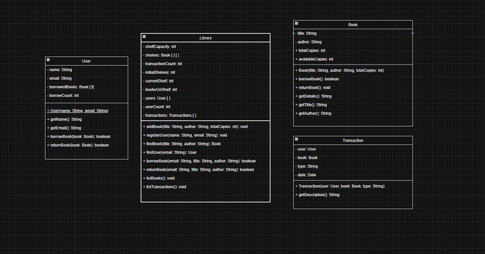

# 📚 Library Management System (Java)

A simple **Library Management System** developed in **Java** using **Object-Oriented Programming (OOP)** concepts.  
This project was created by **Mohammad Nour ALTURKMANI** during my **first semester at FSMV University (FSMVU)** — when I knew absolutely nothing about programming.  
It marks the beginning of my journey as a Software Engineering student and my first real project in Java.
---
## 🎯 Overview

The Library Management System allows a librarian to:
- Add and manage books.
- Register users.
- Borrow and return books.
- Track and display transactions.

It demonstrates the use of **classes, objects, arrays, encapsulation**, and **basic OOP design**.

---

## ⚙️ Features

- 📘 **Add Book** – Add new books with title, author, and total copies.
- 👤 **Register User** – Register new users by name and email.
- 🔍 **Find Book / User** – Search books or users by attributes.
- 📖 **Borrow & Return Books** – Borrow only if copies are available and user hasn’t exceeded 3 books.
- 💾 **View Transactions** – Display all borrowing and returning transactions.
- 🧠 **Dynamic Shelves** – Automatically adds new shelves when capacity is reached.

---

## 🧱 Class Design (UML Overview)

The project is structured around four main classes:

- **Library** – Manages books, users, and transactions.
- **Book** – Represents a book with title, author, and available copies.
- **User** – Represents a library member who can borrow up to three books.
- **Transaction** – Records each borrow or return action.

### 🖼️ UML Diagram


---

## 🖥️ How to Run

1. Clone this repository:

   ```bash
   git clone https://github.com/nour690/Library-Management-System.git

javac Project.java

java Project

---

## 🧩 Example Menu (Console Interaction)

Library Management System:

1. Add a New Book

2. Register a New User

3. Borrow a Book

4. Return a Book

5. Display All Books

6. View Transactions

7. Exit

Sample Run:

Enter Book Title: Java Programming Basics

Enter Author: John Smith

Enter Total Copies: 5

Book 'Java Programming Basics' by John Smith has been added with 5 copies.

---

## 🛠️ Technologies Used

Language: Java

Paradigm: Object-Oriented Programming (OOP)

Concepts: Encapsulation, Arrays, Classes, Methods, Validation, UML

---

## 💡 What I Learned

This was my first real coding project, built during my first semester at FSMVU.
I learned:

1.How to design and structure a program using multiple classes.

2.How to use arrays and methods effectively.

3.How OOP helps organize code and makes programs easier to maintain.

4.That even the simplest projects can teach the most important lessons.

---

## 👨‍💻 Author

Mohammad Nour ALTURKMANI

Software Engineering Student @ FSMV University

📍 Passionate about learning programming and software design.

🗓️ Project created in **December 2024**, during my first semester at FSMVU.
